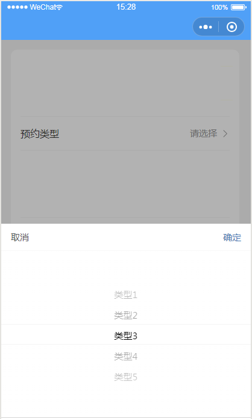
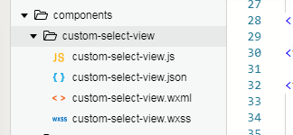

# custom-select-view
微信小程序端自定义组件,自定义的选择器

#### 展示:



```
<custom-select-view
  id="village-select-view" 
  data="{{villages}}" 
  showLabelKey="label" 
  currentLabel="{{currentVillage.label}}"
  bindonSelectCancel="onVillageCancel"
  bindonValueSelected="onVillageSelected">
</custom-select-view>
```

#### 使用:

###### 1.将组件引入项目中components文件夹中



###### 2.在对应页面中引入组件

.json:

```
{
  "usingComponents": {
    "custom-select-view": "../../components/custom-select-view/custom-select-view",
    ...
  },
  ...
}
```

.wxml:

```
<custom-select-view
  id="type-select-view" 
  data="{{types}}" 
  showLabelKey="typeTxt" 
  currentLabel="{{currentType.typeTxt}}"
  bindonSelectCancel="onTypeCancel"
  bindonValueSelected="onTypeSelected">
</custom-select-view>
```

|         属性          |               说明                |
| :-----------------: | :-----------------------------: |
|        data         |    设置选择列表的数据,类型为数组,数组中要求为对象     |
|    showLabelKey     |         设置需要在列表中显示的字段名称         |
|    currentLabel     | 设置当前已选择项目名称,用于每次打开的时候显示当前已选择的数据 |
| bindonSelectCancel  |        点击取消的回调函数(一般用不到)         |
| bindonValueSelected | 点击确认的回调函数(e.detail即为实际选择的列表对象)  |

###### 3.设置数据

.js:

```
data: {
    types: [
      { typeTxt: '类型1', id: 0 },
      { typeTxt: '类型2', id: 1 },
      { typeTxt: '类型3', id: 2 },
      { typeTxt: '类型4', id: 3 },
      { typeTxt: '类型5', id: 4 },
    ],
    currentType: null,
  },
```

###### 4.显示隐藏

```
//显示
this.selectComponent('#type-select-view').show()
//隐藏
this.selectComponent('#type-select-view').hide()
```

###### 5.回调函数

```
  onTypeSelected: function (e) {
    // console.log(e)
    this.setData({
      currentType: e.detail
    })
  },
```

###### 5.重置(当界面中设置的数据在前端置空后,由于组件内的数据仍然有效,此时点击确定,默认选中第一个的时候不会调用到回调函数,因此在前端数据置空的时候,也需要将组件内的数据值为空)

```
this.selectComponent('#type-select-view').reset()
```


